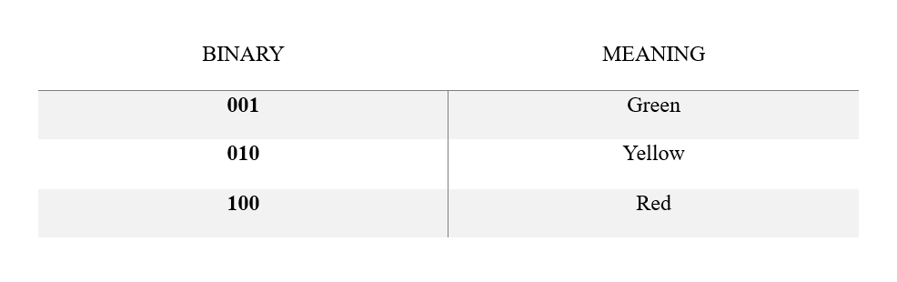

# Traffic_Light_Controller
This project implements a Traffic Light Controller FSM using Verilog HDL and simulates it using Icarus Verilog with waveform analysis in GTKWave.
The controller manages traffic lights for:
- Main Road 1 (M1)
- Main Road 2 (M2)
- Main Turn (MT)
- Side Road (S)
Each traffic light follows the Red–Yellow–Green (RYG) sequence based on a timed finite state machine.
## FSM Overview
The controller uses 6 states (S1–S6):

   

State transitions are controlled using an internal counter that holds the FSM in a state for a fixed duration.
## Light Encoding
Each traffic light output is 3 bits (RYG):

   

## Simulation Details
- Clock period: 10 ns
- Reset: Active HIGH
- Simulation time: 1000 ns
- Waveform file: `Traffic_Light_Controller.vcd`
